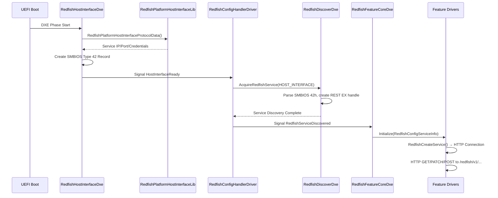

# Redfish Client Architecture Analysis

## Overview

This document analyzes the EDK2 Redfish client architecture to understand when, how, and under what conditions the Redfish client makes HTTP calls to the Redfish service, and whether it's possible to bypass the Host Interface in favor of out-of-band HTTP-only operation.

## Key Components

### 1. RedfishFeatureCoreDxe

**Location**: `redfish-client/RedfishClientPkg/RedfishFeatureCoreDxe/`

**Purpose**: Central coordination hub that manages all Redfish feature drivers and orchestrates the provisioning/consumption process.

**Key Functions**:

- `StartUpFeatureDriver()`: Recursively activates feature drivers based on resource hierarchy
- `SignalReadyToProvisioningEvent()`: Signals that the system is ready for Redfish operations
- `SignalAfterProvisioningEvent()`: Indicates provisioning completion

**Network Call Conditions**: Does not make direct HTTP calls but triggers feature drivers that do.

### 2. RedfishConfigHandlerDriver

**Location**: `edk2/RedfishPkg/RedfishConfigHandler/RedfishConfigHandlerDriver.c`

**Purpose**: Discovers Redfish services and initializes the connection parameters.

**Key Functions**:

- `RedfishServiceDiscoveredCallback()`: Handles discovery completion
- `AcquireRedfishServiceOnNetworkInterfaceCallback()`: Initiates service discovery per network interface
- Creates `REDFISH_CONFIG_SERVICE_INFORMATION` structure with service endpoint details

**Network Call Trigger**:

- Discovery occurs when `gEdkIIRedfishHostInterfaceReadyProtocolGuid` is installed
- Uses `EFI_REDFISH_DISCOVER_HOST_INTERFACE` flag to discover services via Host Interface specification

### 3. Feature Drivers (Bios, ComputerSystem, etc.)

**Location**: `redfish-client/RedfishClientPkg/Features/*/`

**Purpose**: Handle specific Redfish resources (BIOS settings, boot options, system properties).

**Key Functions**:

- `RedfishResourceInit()`: Initializes HTTP service connection via `RedfishCreateService()`
- Resource-specific provisioning and consumption methods

**Network Call Conditions**:

- HTTP calls are made during `Provisioning()` and `Consume()` operations
- Actual HTTP requests handled by `RedfishCreateService()` → EDK2 RedfishLib → REST EX protocol

### 4. HiiToRedfishBootDxe

**Location**: `redfish-client/RedfishClientPkg/HiiToRedfishBootDxe/`

**Purpose**: Bridges HII (Human Interface Infrastructure) configuration with Redfish boot options.

**Key Functions**:

- `HiiToRedfishBootReadyToProvisioning()`: Triggered by ready-to-provisioning event
- `RefreshBootOrderList()`: Updates boot configuration from HII database

**Network Call Trigger**: Responds to provisioning events, may trigger HTTP calls to sync boot settings.

## HTTP Network Call Flow

### Initialization Sequence



### When HTTP Calls Are Made

1. **Service Discovery Phase**:
   - No direct HTTP calls during discovery
   - Uses Host Interface specification (SMBIOS Type 42) for endpoint information
   - Creates REST EX protocol instances for each discovered service

2. **Feature Driver Initialization**:
   - Each feature driver calls `RedfishCreateService()` when initialized
   - This establishes the HTTP service connection but may not immediately make requests

3. **Provisioning Phase** (Push to Redfish):
   - Feature drivers call `Provisioning()` methods
   - HTTP PATCH/POST requests to update Redfish service with current BIOS/system state
   - Typical endpoints: `/redfish/v1/Systems/system/Bios/`, `/redfish/v1/Systems/system/`

4. **Consumption Phase** (Pull from Redfish):
   - Feature drivers call `Consume()` methods
   - HTTP GET requests to retrieve settings from Redfish service
   - Looks for `@Redfish.Settings` annotations for pending changes

### HTTP Request Conditions

HTTP calls will **NOT** be made if:

- Host Interface library returns invalid service configuration
- Network interface is not properly configured (no IP/connectivity)
- Authentication credentials are invalid
- REST EX protocol fails to initialize
- Feature drivers are not properly registered

HTTP calls **WILL** be made when:

- Valid Host Interface configuration exists (IP, port, credentials)
- Network connectivity is established
- Feature drivers are initialized and provisioning events are signaled
- BIOS variables require synchronization with Redfish service

## Host Interface Bypass Analysis

### Current Dependency on Host Interface

The current architecture **requires** the Host Interface specification because:

1. **Service Discovery**: `RedfishConfigHandlerDriver` only supports `EFI_REDFISH_DISCOVER_HOST_INTERFACE` flag
2. **Endpoint Configuration**: Service IP/port comes from `RedfishPlatformHostInterfaceProtocolData()`
3. **SMBIOS Integration**: Creates SMBIOS Type 42 records for service advertisement
4. **REST EX Binding**: Network interface selection based on Host Interface specification

### Bypass Possibilities

#### Option 1: Custom Discovery Mode (Recommended)

**Implementation**: Modify `RedfishConfigHandlerDriver.c` to support a direct configuration mode.

```c
// New flag in RedfishDiscover.h
#define EFI_REDFISH_DISCOVER_DIRECT_CONFIG  0x00000002

// Modified discovery call
Status = gEfiRedfishDiscoverProtocol->AcquireRedfishService (
           gEfiRedfishDiscoverProtocol,
           gRedfishConfigData.Image,
           ThisNetworkInterface,
           EFI_REDFISH_DISCOVER_DIRECT_CONFIG,  // New flag
           ThisRedfishDiscoveredToken
           );
```

**Required Changes**:

- Add direct configuration support to `RedfishDiscoverDxe`
- Create service information directly from EFI variables
- Skip SMBIOS Type 42 creation for direct mode

#### Option 2: Variable-Only Host Interface Library

**Implementation**: Modify `RedfishPlatformHostInterfaceLib` to read exclusively from EFI variables.

**Benefits**:

- Minimal code changes
- Maintains existing architecture
- Backward compatible

**Current Status**: Already partially implemented in RPi4 platform library.

#### Option 3: Network Configuration Protocol

**Implementation**: Create a custom Redfish network configuration protocol that bypasses Host Interface entirely.

**Complexity**: High - requires significant architecture changes.

### Recommended Approach

**Use Option 2 (Variable-Only Host Interface Library)** because:

1. **Minimal Changes**: Only requires updating the RPi4 platform library
2. **Maintains Compatibility**: Existing feature drivers work unchanged
3. **Already Functional**: Current implementation reads from EFI variables
4. **Standards Compliant**: Still follows Host Interface patterns

#### Implementation Status

The RPi4 `RedfishPlatformHostInterfaceLib` already supports variable-based configuration:

```c
// Current variables used:
- RedfishServiceIpAddress     (Service endpoint IP)
- RedfishServiceIpPort        (Service port, default 5000)  
- RedfishServiceUserId        (Authentication username)
- RedfishServicePassword      (Authentication password)
- RedfishServiceAuthenticationEnabled (Auth toggle)
```

#### Missing Components for Full Bypass

1. **Variable Initialization**: ConfigDxe needs HII Config Access Protocol to save settings
2. **Network Interface Selection**: May need explicit MAC/interface specification
3. **Service Validation**: Add connectivity testing before feature driver initialization

## Network Call Debugging

### Enable Debug Output

```c
// In platform .dsc file
DEBUG_PRINT_ERROR_LEVEL = 0x8000004F

// Key debug categories:
DEBUG_MANAGEABILITY     // Redfish operations
DEBUG_ERROR            // Error conditions  
DEBUG_INFO             // Informational messages
```

### Monitor Network Traffic

```bash
# Monitor specific interface
sudo tcpdump -i en6 -A -s 0 'host 10.0.198.24 and port 5000'

# Check for HTTP requests
sudo tcpdump -i en6 -A -s 0 'tcp port 5000 and (tcp[tcpflags] & tcp-push != 0)'
```

### Verification Points

1. **Host Interface Ready**: Look for `HostInterfaceReady` protocol installation
2. **Service Discovery**: Check for `RedfishServiceDiscovered` events
3. **Feature Driver Init**: Verify `RedfishCreateService()` success
4. **HTTP Connection**: Monitor REST EX protocol binding
5. **Request Generation**: Check feature driver provisioning calls

## Conclusions

### Network Call Triggers

The Redfish client makes HTTP calls under these specific conditions:

1. **Host Interface Configuration Available**: Valid service IP, port, and credentials
2. **Network Connectivity Established**: Interface up, routing configured
3. **Feature Drivers Initialized**: RedfishCreateService() successful
4. **Provisioning Events Signaled**: Ready-to-provisioning event triggered
5. **Resource Synchronization Needed**: BIOS/system settings require updates

### Host Interface Bypass

**Yes, Host Interface can be bypassed** using the variable-only approach:

- Current RPi4 implementation already reads from EFI variables
- No SMBIOS Type 42 dependency required for direct configuration
- Feature drivers work unchanged with variable-based service information
- Requires completing HII Config Access Protocol for variable management

### Next Steps

1. **Complete HII Integration**: Finish ConfigDxe callback implementation
2. **Test Variable Configuration**: Verify service discovery with variable-only setup
3. **Validate Network Calls**: Confirm HTTP requests with tcpdump monitoring
4. **Document Variable Schema**: Standardize EFI variable names and formats
