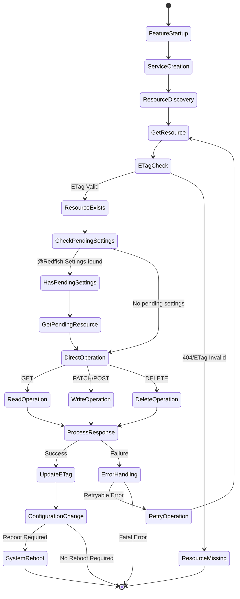
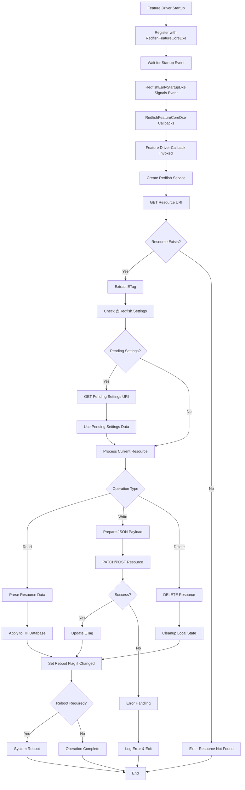

# Redfish Client REST Service Invocation Documentation

## Overview

This document provides a comprehensive analysis of REST service invocations within the `RedfishClientPkg`, including usage patterns, state flows, and implementation guidelines.

## Architecture Overview

The RedfishClientPkg implements a layered architecture for REST service interactions:

```text
┌─────────────────────────────────────────────────────────────┐
│                    Feature Drivers                          │
│  (BiosDxe, BootOptionDxe, ComputerSystemDxe, etc.)         │
└─────────────────┬───────────────────────────────────────────┘
                  │
┌─────────────────▼───────────────────────────────────────────┐
│              RedfishFeatureCoreDxe                          │
│         (Event-driven Feature Management)                  │
└─────────────────┬───────────────────────────────────────────┘
                  │
┌─────────────────▼───────────────────────────────────────────┐
│          RedfishFeatureUtilityLib                          │
│         (Common REST Operations & Utilities)               │
└─────────────────┬───────────────────────────────────────────┘
                  │
┌─────────────────▼───────────────────────────────────────────┐
│              RedfishLib                                     │
│            (HTTP Transport)                                │
└─────────────────────────────────────────────────────────────┘
```

## REST Service Invocation Patterns

### 1. Primary REST Operations

The RedfishClientPkg uses four main REST operations:

#### A. `RedfishHttpGetResource`

**Purpose**: Retrieve resource data from Redfish service  
**Usage Count**: 23+ instances across the codebase  
**Common Use Cases**:

- Reading resource configurations
- Checking resource existence
- Retrieving ETag for version control
- Fetching collection members

#### B. `RedfishHttpPatchResource`

**Purpose**: Update existing resource properties  
**Usage Count**: 3+ instances  
**Common Use Cases**:

- Updating BIOS settings
- Modifying boot option configurations
- Applying configuration changes

#### C. `RedfishHttpPostResource`

**Purpose**: Create new resources  
**Usage Count**: 2+ instances  
**Common Use Cases**:

- Creating new boot options
- Resetting BIOS to defaults
- Triggering actions

#### D. `RedfishHttpDeleteResource`

**Purpose**: Remove existing resources  
**Usage Count**: 1+ instance  
**Common Use Cases**:

- Deleting boot options
- Removing configuration entries

### 2. Service Creation Pattern

All feature drivers follow a consistent service creation pattern:

```c
// Service creation in feature driver initialization
Private->RedfishService = RedfishCreateService (RedfishConfigServiceInfo);
```

**Locations**:

- BiosDxe.c:474
- BootOptionDxe.c:464
- ComputerSystemDxe.c:471
- MemoryDxe.c:468
- SecureBootDxe.c:473
- And all collection drivers

### 3. ETag Management Pattern

ETag handling follows a consistent pattern for version control:

```c
// Set ETag after successful GET
SetEtagFromUri(Private->RedfishService, Private->Uri, TRUE);

// Get ETag for comparison
Status = GetHttpResponseEtag(&Response, &Etag);

// Check ETag before operations
if (!CheckEtag(Uri, EtagInHeader, EtagInJson)) {
  // Handle version mismatch
}
```

### 4. Pending Settings Pattern

For resources supporting `@Redfish.Settings`:

```c
Status = GetPendingSettings(
  RedfishService,
  Response.Payload,
  &SettingResponse,
  &SettingUri
);
```

## State Diagram: REST Operation Flow



## Process Flow: Feature Driver Operation



## Implementation Guidelines

### 1. Feature Driver REST Implementation

When implementing a new feature driver:

```c
// 1. Service Creation (in driver initialization)
Private->RedfishService = RedfishCreateService (RedfishConfigServiceInfo);
if (Private->RedfishService == NULL) {
  DEBUG ((DEBUG_ERROR, "%a: Failed to create Redfish service\n", __func__));
  return EFI_DEVICE_ERROR;
}

// 2. Resource Retrieval Pattern
Status = RedfishHttpGetResource (
  Private->RedfishService,
  Private->Uri,
  NULL,
  &Response,
  TRUE  // Use cache
);
if (EFI_ERROR (Status)) {
  DEBUG ((DEBUG_ERROR, "%a: Failed to get resource: %r\n", __func__, Status));
  return Status;
}

// 3. ETag Management
if (!EFI_ERROR (Status)) {
  SetEtagFromUri (Private->RedfishService, Private->Uri, TRUE);
}

// 4. Pending Settings Check
Status = GetPendingSettings (
  Private->RedfishService,
  Response.Payload,
  &SettingResponse,
  &SettingUri
);

// 5. Resource Modification Pattern
Status = RedfishHttpPatchResource (
  Private->RedfishService,
  Private->Uri,
  JsonPayload,
  &Response
);
if (!EFI_ERROR (Status)) {
  REDFISH_ENABLE_SYSTEM_REBOOT();  // Flag reboot if needed
}
```

### 2. Error Handling Best Practices

```c
// Always check HTTP status codes
if ((Response.StatusCode != NULL) && 
    (*(Response.StatusCode) != HTTP_STATUS_200_OK)) {
  DEBUG ((DEBUG_ERROR, "%a: HTTP error %d\n", __func__, *(Response.StatusCode)));
  Status = EFI_DEVICE_ERROR;
}

// Report status codes for monitoring
REPORT_STATUS_CODE_WITH_EXTENDED_DATA (
  EFI_ERROR_CODE | EFI_ERROR_MAJOR,
  EFI_COMPUTING_UNIT_MANAGEABILITY | EFI_MANAGEABILITY_EC_REDFISH_COMMUNICATION_ERROR,
  REDFISH_COMMUNICATION_ERROR,
  sizeof (REDFISH_COMMUNICATION_ERROR)
);

// Always cleanup resources
RedfishHttpFreeResponse (&Response);
```

### 3. Configuration Management Pattern

```c
// Read current configuration
Status = RedfishPlatformConfigGetValue (Schema, Version, ConfigureLang, &CurrentValue);

// Compare with Redfish data
if (RedfishValue != CurrentValue) {
  // Apply new configuration
  Status = RedfishPlatformConfigSetValue (Schema, Version, ConfigureLang, RedfishValue);
  if (!EFI_ERROR (Status)) {
    REDFISH_ENABLE_SYSTEM_REBOOT();
  }
}
```

## Key Components and Dependencies

### 1. Service Configuration Sources

The Redfish service configuration comes from:

- **Host Interface Discovery**: Standard DMTF discovery mechanism
- **Manual Configuration**: Platform-specific settings
- **Early Startup Override**: Your `RedfishEarlyStartupDxe` bypass

### 2. Critical Libraries

- **RedfishFeatureUtilityLib**: Common REST operations and utilities
- **RedfishEventLib**: Event signaling for provisioning phases
- **RedfishLib**: Low-level HTTP transport
- **RedfishVersionLib**: Service version detection

### 3. Protocol Dependencies

- **EdkIIRedfishFeatureProtocol**: Feature driver registration
- **EdkIIRedfishETagProtocol**: ETag management
- **EdkIIRedfishPlatformConfigProtocol**: HII configuration access

## REST Operation Locations

### RedfishHttpGetResource Usage

1. **RedfishFeatureUtilityLib.c:157** - ETag retrieval
2. **RedfishFeatureUtilityLib.c:3635** - Pending settings
3. **BiosDxe.c:60,125,259,329,407** - BIOS resource operations
4. **BootOptionDxe.c:54,116,249,319,397** - Boot option operations
5. **BootOptionCollectionDxe.c:168,461** - Collection enumeration
6. **ComputerSystemCollectionDxe.c:304** - System collection
7. **MemoryCollectionDxe.c:286** - Memory collection
8. **RedfishVersionLib.c:111** - Service version detection

### RedfishHttpPatchResource Usage

1. **BiosCommon.c:529,739** - BIOS settings updates
2. **BootOptionCommon.c:786** - Boot option modifications

### RedfishHttpPostResource Usage

1. **BiosCommon.c:378** - BIOS reset actions
2. **BootOptionCommon.c:492** - Boot option creation

### RedfishHttpDeleteResource Usage

1. **BootOptionCommon.c:641** - Boot option deletion

## Security Considerations

1. **Authentication**: All REST calls inherit authentication from service creation
2. **TLS**: HTTPS transport is used when configured
3. **Authorization**: Resource access controlled by BMC/service permissions
4. **ETag Validation**: Prevents concurrent modification conflicts
5. **Input Validation**: JSON payloads validated before transmission

## Performance Optimization

1. **Caching**: Use caching parameter in GET operations when appropriate
2. **ETag Management**: Reduces unnecessary transfers
3. **Batch Operations**: Group related changes when possible
4. **Error Recovery**: Implement retry logic for transient failures

## Discovery Service Bypass Impact

Your `RedfishEarlyStartupDxe` implementation successfully bypasses the discovery service by:

1. **Direct Event Signaling**: Triggers `RedfishFeatureCoreDxe` startup directly
2. **Service Configuration**: Must provide `RedfishConfigServiceInfo` independently
3. **Protocol Independence**: REST operations work regardless of discovery method
4. **Full Functionality**: All documented patterns remain functional

The REST service invocation patterns are **completely independent** of the discovery mechanism, making your bypass approach highly effective for RPi NIC compatibility issues.
