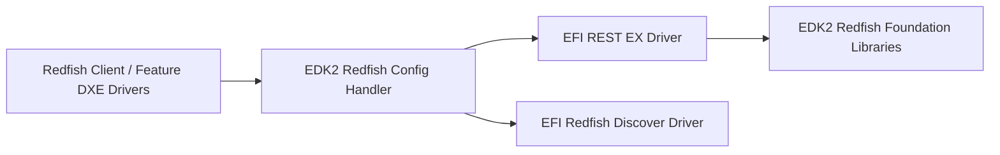
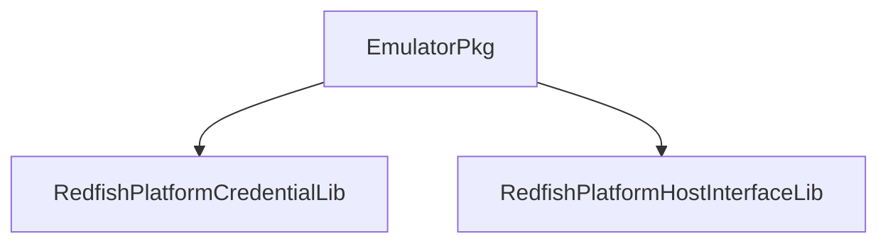

# UEFI Redfish EDK2 Implementation

Introduction

UEFI Redfish EDK2 solution is an efficient and secure solution for end‑users to remotely configure (out‑of‑band) UEFI platform configurations by leveraging the Redfish RESTful API. It enables access to UEFI firmware configurations with Redfish schema–equivalent properties.

Below are the block diagrams of UEFI Redfish EDK2 Implementation.
EDK2 Redfish Foundation (lower part) provides fundamental EDK2 drivers to communicate with Redfish service. The Redfish service may be implemented in BMC or remotely to manage one or multiple systems.

EDK2 Redfish Client (upper part) is the EDK2 Redfish application used to configure platform configurations by consuming Redfish properties, provisioning platform‑owned properties, and updating them. Feature DXE drivers in edk2-redfish-client (e.g. Edk2RedfishBiosDxe) implement communication with specific Redfish data models in the schema.

EDK2 Redfish Implementation Diagrams

UEFI Redfish Implementation:

EFI EDK2 Redfish Driver Stack

Drivers implemented in EDK2:

EDK2 Redfish Host Interface DXE Driver [6]

Abstract DXE driver to create SMBIOS type 42 records via EFI SMBIOS protocol from device descriptor and protocol-type data from Redfish Host Interface library. In EmulatorPkg, SMBIOS type 42 data is read from EFI variables created by RedfishPlatformConfig.efi [20]. OEMs may provide their own PlatformHostInterfaceLib instance [11].

EDK2 Redfish Credential DXE Driver [5]

Abstract DXE driver that works with RedfishPlatformCredentialLib [10] to obtain Redfish service credentials. In EmulatorPkg, the credentials are hardcoded for use with Redfish Profile Simulator. OEMs may provide their own credential lib.

EFI REST EX UEFI Driver for Redfish service [4]

Network-based implementation of the EFI_REST_EX protocol (UEFI spec 2.8 §29.7.2) for communicating with Redfish service over HTTP. OEMs may provide proprietary transport.

EFI Redfish Discover UEFI Driver [3]

Implements Redfish Discover Protocol (UEFI spec 2.8 §31.1), supporting only discovery via Redfish Host Interface (SSDP over UDP not yet supported).

EFI REST JSON Structure DXE Driver [9]

Implements EFI REST JSON Structure (UEFI spec 2.8 §29.7.3), used by feature DXE drivers [17]. Converts between C structure and JSON payload using Redfish Schema → C generator.

EDK2 Redfish Config Handler UEFI Driver [15]

Central manager for feature drivers; invokes init() of each feature driver’s Config Handler Protocol [16]. Depends on EFI_REST_EX and uses EFI Redfish Discover to find the Redfish service managing the system.

EDK2 Content Coding Library [12]

Works with RedfishLib [13] to encode/decode JSON payloads, supporting HTTP Content-Encoding headers. EmulatorPkg uses the NULL instance since the simulator does not support content encoding.

Other Open Source Projects

These wrappers are used by RedfishPkg:
 • RedfishLib [13] — wraps libredfish, handling connection to Redfish service and CRUD operations.
 • JsonLib [14] — wraps Jansson, exposing JSON manipulation APIs.

Platform Components

EDK2 EmulatorPkg

Image: EDK2 EmulatorPkg Figure

 • RedfishPlatformCredentialLib — hardcoded credentials to connect UEFI firmware to Redfish simulator.
 • RedfishPlatformHostInterfaceLib — builds SMBIOS Type 42 records using EFI variables created by RedfishPlatformConfig.efi.

Platform with BMC and BMC‑Exposed USB NIC

Image: Platform with BMC Figure

Server platforms with BMC may expose a USB NIC that creates a link-local interface for communication. The host enumerates the USB NIC via UEFI USB bus driver, loading it as a network device used by the EFI SNP driver and higher-level networking stack to access the BMC’s Redfish service.

BMC‑Platform Libraries
 • RedfishPlatformCredentialLib — uses IPMI-based Redfish Credential Bootstrapping commands from Host Interface spec to obtain credentials.
 • RedfishPlatformHostInterfaceLib — uses IPMI commands to retrieve MAC, IP, subnet, gateway, VLAN and matches based on MAC to correctly identify the BMC-exposed USB NIC.
 • MAC address rule: host-end MAC = BMC-end MAC − 1 (e.g. BMC: 11‑22‑33‑44‑55‑00, host: 11‑22‑33‑44‑55‑ff)
 • IP address rule: host-end IPv4 = BMC-end minus 1 (e.g. BMC 165.10.0.10, host 165.10.0.9)
 • Other network properties (subnet mask, gateway) are fetched from BMC and applied to host.

⸻

IPMI Commands Used to Build Redfish Host Interface for BMC-exposed USB NIC

NetFn Command Purpose Corresponding Host Interface Field
App (0x06) 0x42 Check message channel medium & protocol (802.3 LAN / IPMB 1.0) —
Transport (0x0C) 0x02 Get MAC address of message channel —
Group Ext (0x2C) 0x52 / 0x02 Check credential bootstrapping support Credential Bootstrapping Handle
Transport (0x0C) 0x02 (param 0x04) Get BMC-end message channel IP address source Host IP Assignment Type, Redfish Service IP Discovery
Transport (0x0C) 0x02 (param 0x03) Get BMC-end IPv4 address Host IP Address Format, Host IP Address
Transport (0x0C) 0x02 (param 0x06) Get BMC-end IPv4 subnet mask Host IP Mask, Redfish Service IP Mask
Transport (0x0C) 0x02 (param 0x12) Get BMC-end gateway IP address —
Transport (0x0C) 0x02 (param 0x14) Get BMC-end VLAN ID Redfish Service VLAN ID

Note: Current implementation supports only IPv4 format.

Miscellaneous
 • RedfishPlatformConfig.efi: EFI Shell application to configure Redfish service info (IP, subnet, port).
Example:

RedfishPlatformConfig.efi -s 192.168.10.101 255.255.255.0 192.168.10.123 255.255.255.0

Here, 192.168.10.101 is the host source IP and 192.168.10.123 is the Redfish Server IP.

 • Redfish Profile Simulator: used to emulate Redfish service for EmulatorPkg; contributions to enhance compatibility with EDK2 are ongoing.

Connect to Redfish Service on EDK2 Emulator Platform

 1. Install WinPcap and copy SnpNt32Io.dll to the Emulator build directory (e.g. %WORKSPACE%/.../X64).
 2. In EmulatorPkg.dsc, enable:

NETWORK_SNP_ENABLE = TRUE
NETWORK_HTTP_ENABLE = TRUE
NETWORK_IP6_ENABLE = TRUE
SECURE_BOOT_ENABLE = TRUE
REDFISH_ENABLE = TRUE

 3. Allow HTTP connections (Simulator lacks HTTPS):

NETWORK_ALLOW_HTTP_CONNECTIONS = TRUE

 4. Assign correct MAC address from ifconfig -l output to:

gEfiRedfishPkgTokenSpaceGuid.PcdRedfishRestExServiceDevicePath.DevicePath|{DEVICE_PATH("MAC(000000000000,0x1)")}

 5. Set the network adapter:
  • Windows host: gEmulatorPkgTokenSpaceGuid.PcdEmuNetworkInterface|L"1"
  • Linux host: gEmulatorPkgTokenSpaceGuid.PcdEmuNetworkInterface|L"en0"
 6. Configure Redfish service via RedfishPlatformConfig.efi under EFI shell to create EFI variables consumed by RedfishPlatformHostInterfaceLib.

Related Materials

 1. DSP0270 – Redfish Host Interface Specification, v1.3.0
 2. DSP0266 – Redfish Specification, v1.12.0
 3. Redfish Schemas – available at <https://redfish.dmtf.org/schemas/v1/>
 4. SMBIOS – DMTF Standard DSP0134_3.6.0
 5. USB CDC specification
 6. UEFI Specification (UEFI.org)

The Contributors

Thanks to:
 • Siyuan Fu
 • Ting Ye
 • Fan Wang
 • Jiaxin Wu
 • Jiewen Yao
 • Cinnamon Shia

(contact details redacted for privacy)

⸻

Let me know if you have the exact diagrams and want them inserted into the Mermaid blocks!
